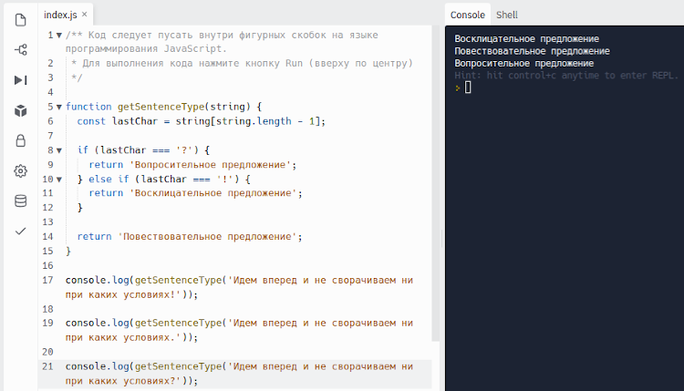

## Задание 2. Задача на JavaScript. Сложнее, но есть инструкция

Эта задача для тех, кому первая показалась слишком простой, а программирование интересно.
Если вы никогда раньше не писали код, то вам, скорее всего, будет сложно, возможно, даже очень сложно и потребуется много времени. Но если вам действительно интересно, то обязательно попробуйте! Это будет ваш первый код)

Несколько рекомендаций:

- Используйте инструкцию для выполнения задания, которую мы для вас подготовили.
- Вам потребуется теоретическая база об условных конструкциях if else.
- Вы можете её загуглить или почитать здесь: https://metanit.com/web/javascript/2.6.php
- После отправки задания мы пришлём вам наш вариант кода, и вы сможете проверить себя.

**Инструкция по регистрации на Repl.It**

Для решения задачи вам необходимо зарегистрироваться на платформе Repl.IT. Это «платформа-песочница», в которой программисты могут учиться решать задачи. Программы, которые вы напишете сейчас и позже, будут сохраняться в вашем личной кабинете.

Перейдите по ссылке [Repl.IT](https://repl.it/), нажмите Sign Up и зарегистрируйтесь:


Теперь переходим к задаче. Перейдите по [ссылке](https://repl.it/@Netology/Task-2#index.js) с условием задачи.

Нажмите Fork repl и у Вас загрузится текст задачи.


В левом окне вы сможете приступить к решению задачи.

**Задача**

Научите функцию определять тип переданного ей предложения. Функция должна возвращать один из трёх ответов: «восклицательное предложение», «вопросительное предложение» или «повествовательное предложение».

Решать задачу будем на платформе Repl.It. Условие задачи описано [здесь](https://repl.it/@Netology/Task-2#index.js). Для неё мы выбрали язык программирования JavaScript (JS).

Если требуется помощь, то читайте объяснения ниже. Если нет — решайте полностью самостоятельно. Наш вариант Вы получите после отправки Вашего решения в личном кабинете.

1. Для начала познакомимся с функцией. Перед Вами функция по имени **getSentenceType** (строка 6). Функция, как говорят программисты, ожидает на вход аргумент. Это следует из круглых скобок, в которых написано **string**


При вызове функции мы будем передавать в качестве аргумента строку с предложением. В нашем случае функция вызывается с предложением '**Идем вперед и не сворачиваем ни при каких условиях!**' (строка 10). Кавычки обязательны. Для программы это означает, что ей передана именно строка, а не число или любой другой тип данных.

2. Внутри фигурных скобок пишется так называемое тело функции — те самые действия, которые необходимо выполнить с поступившим аргументом для получения нужного результата.


3. Наша задача — определить характер указанного предложения. Сейчас в конце предложения стоит восклицательный знак. Поэтому наша функция должна нам сообщить, что предложение является восклицательным.

Если поменять восклицательный знак на вопросительный, то функция скажет, что предложение является вопросительным. Если в конце предложения нет ни восклицательного, ни вопросительного знака — будем считать предложение повествовательным. Но чтобы функция могла нам это сообщить, необходимо написать свой код внутри фигурных скобок.

Помните, код следует писать на языке JavaScript внутри фигурных скобок. А чтобы выполнить функцию и проверить свой код на работоспособность, нужно нажать 'Run' (кнопка находится вверху по центру). В правой стороне экрана (на чёрном фоне) будет результат выполнения программы.


4. Наша функция должна определить последний символ предложения. Нужно создать константу, в неё записать именно последний символ строки. Как это сделать:

Чтобы обратиться к последнему символу, нам нужно знать его индекс (это порядковый номер, нумерация начинается с 0). Для определения индекса вычисляем длину строки при помощи свойства length (string.length) и отнимаем от результата 1 (потому что нумерация у нас начинается с 0). Так мы получим индекс последнего символа строки. Теперь мы можем обратиться к последнему символу строки по его индексу string[string.length - 1]. Этот результат и записываем в константу const = ...наше выражение...


5. Далее, получив последний символ и записав его в константу, мы можем его проверить и убедиться, что всё работает корректно. Для этого выведите вашу константу, содержащую последний символ в консоль: console.log(имя вашей константы). Нажав на Run вы увидите результат вычислений, и если всё сделано правильно — результатом будет последний символ строки.


Если всё верно, то console.log можно удалить из кода. Он нужен был только для проверки, что вы правильно выбрали последний символ, — это очень важно, ведь дальше будем работать с ним.

6. Далее нам нужно сравнить его с двумя символами, а именно с '!' и '?'
   Нам нужна условная конструкция if else:

```js
if (условие) {
} else if (условие) {
}
```

Первый if должен сравнить последний символ строки, записанный в нашу константу, например, со знаком '!'. Если совпало, то возвращаем (return) 'предложение восклицательное'. Если не совпало, то следующий if должен сравнить последний символ со знаком '?'. Если совпало, то возвращаем строку 'вопросительное предложение'. Если совпадений совсем нет — возвращаем строку 'повествовательное предложение'. Это можно сделать последней строкой нашей программы.

Ключевое слово return прерывает действие функции и возвращает из неё результат, который мы обозначаем сразу за этим ключевым словом. Таким образом у нас будет 3 слова return — два из них внутри условий (если какое-то условие срабатывает, то функция прерывается и возвращает нужный нам ответ). Если никакое условие не выполнено — то те return, что внутри условий, не выполняются, и программа переходит на строку, находящуюся за пределами условий, а там будет наш return с ответом «повествовательное предложение».

7. Посмотреть результат выполнения файла можно, нажав на кнопку Run. Результат появится в правой части окна.

Ответ при отправке задания:


```js
function getSentenceType(string) {
  const lastChar = string[string.length - 1];

  if (lastChar === "?") {
    return 'Вопросительное предложение';
  } else if (lastChar === "!") {
    return 'Восклицательное предложение';
  }

  return 'Повествовательное предложение';
}


console.log(getSentenceType('Идем вперед и не сворачиваем ни при каких условиях!');

console.log(getSentenceType('Идем вперед и не сворачиваем ни при каких условиях.');

console.log(getSentenceType('Идем вперед и не сворачиваем ни при каких условиях?');
```
Важно: в программировании не бывает единственного верного решения. Если Ваш код выглядит иначе, но при этом программа работает и выдаёт верное решение, значит он тоже правильный.

Если программа не работает, то изучите наше решение и подкорректируйте свой код.
